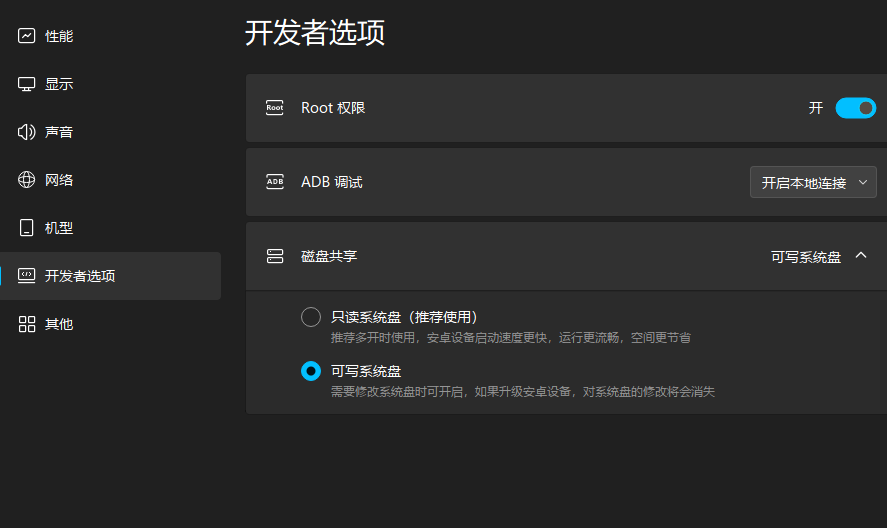

# MuMuClear

面向 **Android 15** 的 MuMu 模拟器桌面清理工具。

用精简版 Lawnchair 替换系统默认桌面，去掉 MuMu 自带桌面上的广告与推荐内容，恢复干净、可点的应用图标桌面。

- 仓库：https://github.com/MurasameCyan/MuMuClear
- 发布：https://github.com/MurasameCyan/MuMuClear/releases

## 适用范围

| 项目 | 说明 |
|------|------|
| 系统 | **仅 Android 15**（API 35） |
| 环境 | MuMu 模拟器（Windows） |
| 目标 | 清理默认桌面广告，安装清爽桌面 |

不保证适用于 Android 14 及以下，或其他非 MuMu 环境。

## 做什么

1. 自动连接本机 MuMu 的 adb
2. 以系统特权方式安装已适配 Android 15 的 Lawnchair
3. 设为默认桌面（HOME）
4. 去掉原系统桌面带来的广告/推广入口（通过替换默认启动器实现）

## 下载

到 [Releases](https://github.com/MurasameCyan/MuMuClear/releases) 下载 **`MuMuClear-share.zip`**，解压即可。

## 使用教程

### 1. 开启 Root 与可写系统（必做）

MuMuClear 需要 **Root** 和 **可写系统**，否则无法把清爽桌面装到系统分区。

1. 打开 **MuMu 模拟器**
2. 点右上角 **三条横线菜单**（或设置入口）→ **设置**
3. 左侧进入 **磁盘**
4. 打开：
   - **可写系统**（Writable system）
   - **Root 权限**
5. 按提示 **重启模拟器**，重启完成后再继续

示意（MuMu 设置 → 磁盘）：



> 若开关为灰色无法打开，请先完全退出 MuMu 再开，或新建一个 **Android 15** 实例后再设置。

### 2. 运行安装脚本

```powershell
# 1. 确认 MuMu 已进入 Android 15，且 Root / 可写系统已开启
# 2. 解压 MuMuClear-share.zip
# 3. 在解压目录打开 PowerShell：
.\MuMuClear.ps1 -PrivilegedInstall
```

按提示完成后，按 **Home** 应进入无广告的 Lawnchair 桌面。

### 常用命令

```powershell
.\MuMuClear.ps1 -PrivilegedInstall   # 推荐：清理桌面广告并安装清爽桌面
.\MuMuClear.ps1 -RecoverOnly         # 黑屏 / 无法回桌面时的救援
.\MuMuClear.ps1 -ConnectOnly         # 仅连接 adb，不改桌面
.\MuMuClear.ps1 -Help
```

若提示无法运行脚本：

```powershell
powershell -NoProfile -ExecutionPolicy Bypass -File .\MuMuClear.ps1 -PrivilegedInstall
```

## 分享包内容

```text
MuMuClear.ps1                              # 唯一脚本
tool/
  Lawnchair_app.lawnchair_signed.apk       # Android 15 适配桌面
  LawnchairRecentsOverlay.apk
  privapp-permissions-app.lawnchair.xml
  Adb/                                     # 便携 adb
```

## 说明

- **必须**先开启 Root + 可写系统并重启模拟器
- 安装过程可能再次重启模拟器，属正常
- 数据目录：`/data/user/0/app.lawnchair`
- 若安装后黑屏或无法回桌面：执行 `.\MuMuClear.ps1 -RecoverOnly`
